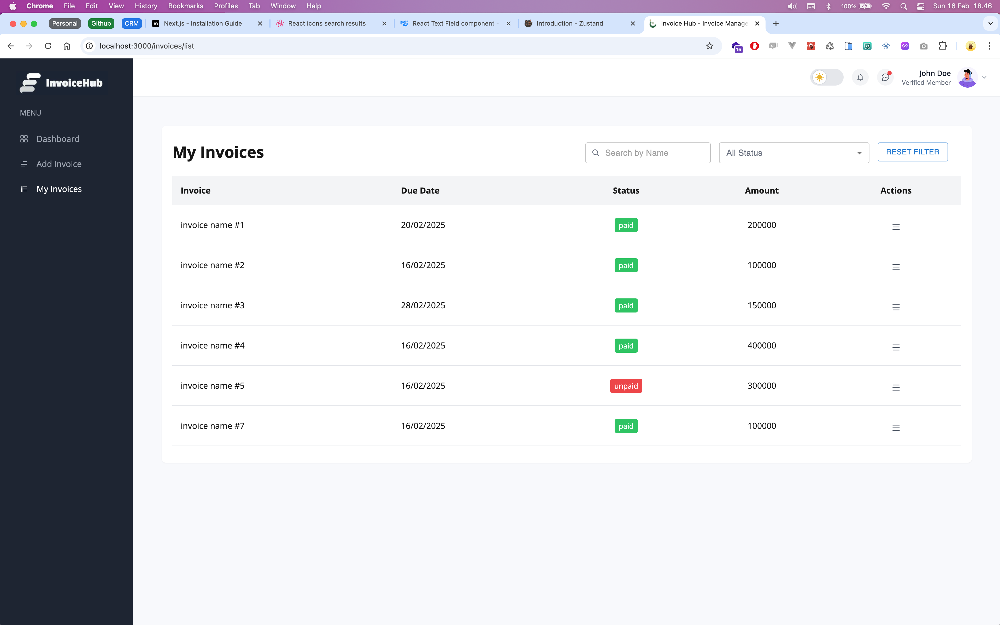

## Project Information


Hello I'm Fathan. my experience in industry frontend development have more than 7 years. every day I use React.js, Vue.js, TypeScript, TailwindCSS.

----

## Technology Stack

```bash
- TypeScript 5
- React.js 18
- Next.js 14
- Zustand for State Management
- TailwindCSS 3.4.1
```

## Getting Started

First, run the development server:

```bash
$ npm run dev
# or
$ yarn dev
# or
$ pnpm dev
```

For build to production run:
```bash
$ npm run build
```

For run Unit Testing:
```bash
$ npm run test
```

Open [http://localhost:3000](http://localhost:3000) with your browser to see the result.

----

## Production
- Project has been deployed in Vercel. please check this link: [`https://frontend-test-nabituid.vercel.app`](https://frontend-test-nabituid.vercel.app).

----

# Screenshot projects


~ Invoice List


~ Invoice Form

<br>
<br>


Thank you